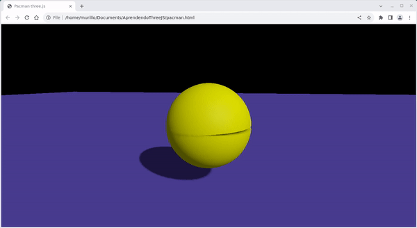

# Aprendendo three.js

Esse repositório possui arquivos usados para o aprendizado de [**three.js**](https://threejs.org/). O estudo foi baseado principalmente no material: [https://adolfoguimaraes.github.io/threejs/](https://adolfoguimaraes.github.io/threejs/)

## Organização

No arquivo html `cubo.html` temos a seguinte linha:

> 

O valor de `src` é quem define o script que será executado ao visualizar o html, ou seja, qual cena queremos ver. Esses scripts são arquivos feitos com JavaScript que usam a biblioteca **three.js**. Os possíveis valores para `src` são os próprios nomes dos arquivos, sendo 5 para o arquivo `cubo.html`, todos iniciando com `scripts_cubo/`, sendo essa a pasta onde os scripts estão. Os scripts estarão descritos mais a frente.

**Obs** : comentários explicando o código estão presentes na primeira utilização dele, por exemplo: a explicação de como posicionar um objeto usando o método *position.set()* está apenas no arquivo *cubo\_js2.js*, em seu uso na função de criação do cubo.

## Scripts Cubo

### cubo\_js1.js

cria uma cena simples, com apenas um cubo no centro da tela. A cena não possui animação, o que faz com que o cubo apareça apenas como um quadrado. Com esse script aprendemos a:

- criar uma cena;
- criar uma câmera com *PerspectiveCamera*;
- criar um renderizador;
- criar um cubo usando uma malha;
- posicionar objetos.

### cubo\_js1\_2.js

Adicona uma animação ao cubo. Com esse script aprendemos a:

- animar um objeto na cena;
- rotacionar um objeto.

### cubo\_js2.js

Movimenta o cubo para longe da câmera. Com esse script aprendemos a:

- como a *PerspectiveCamera* funciona:
    - se possuirem o mesmo tamanho, objetos distantes são menores que objetos mais próximos;
    - existe senso de profundidade;
- como o eixo z está posicionado na cena;
- usar o método *position.set()*.

### cubo\_js2\_2.js

Movimenta o cubo para longe da câmera, usando dessa vez a _OrthographicCamera_. O cubo demora alguns segundos para entrar em cena, e segundos depois ele some. Com esse script aprendemos a:

- como a *OrthographicCamera* funciona:
    - se possuirem o mesmo tamanho, objetos próximos e longe aprecerão na cena o mesmo tamanho;
    - não existe um senso de profundidade;
- como os planos de corte frontal e traseiro influenciam na cena:
    - definidos pelos parâmetros *near* e *far* presentes em ambos tipos de câmeras;
    - objetos posicionados fora do intervalo entre os valores passados, não serão renderizados, o que acontece com o cubo no início da cena e após alguns segundos.

### cubo\_js3.js

Acrescenta luz e sombra à cena. Com esse script aprendemos a:

- criar uma fonte de luz usando *SpotLight*;
- usar materiais próprios para usar com luz *SpotLight*;
- renderizar sombras;
- fazer com que objetos gerem sombra;
- fazer com que objetos recebam sombra;
- criar planos;
- reposicionar a câmera e apontá-la para a cena.

### cubo\_js3\_2.js

Mostra a cena a partir de duas câmeras, dividindo a tela entre elas. Na câmera da esquerda, vemos a cena do mesmo lado onde está a fonte da luz, o oposto do que acontece na câmera da direita. Essa diferença pode ser percebida pela sombra nos planos, mais perceptível na câmera da direita. Com esse script aprendemos a:

- usar duas câmeras simultaneamente com *ArrayCamera*;
- usar o método *Vector4*, para criar um vetor de 4 elementos, nesse caso necessário para posicionar a vista das câmeras na tela;
- atualizar a matriz de projeção da câmera, necessário após alterar algum de seus parâmetros.

## Scripts Pacman

Nesse seção temos o início da modelagem do personagem Pacman, usando em geral os conceitos aprendidos até aqui. O objetivo é estudar a viabilidade de construir uma animação com o personagem.

### pacman\_js1.js

Vemos a partir de uma *OrthographicCamera*, o pacman abrindo a boca, a animação então pausa. Com esse script aprendemos a:

- modelar a metade de uma esfera;
- usar comandos de decisão na animação.

### pacman\_js2.js

Ainda usando a *OrthographicCamera*, agora vemos o pacman fechando e abrindo a boca. É uma evolução na lógica do script *pacman_js1.js*.

### pacman\_js3.js

Temos a mesma cena do script anterior, mas com aplicação de luzes e preenchimento da boca do pacman (um disco no lugar da abertura de cada esfera). Com esse script aprendemos a:

- criar uma circunferência;
- usar luz direcional;
- usar luz ambiente.

